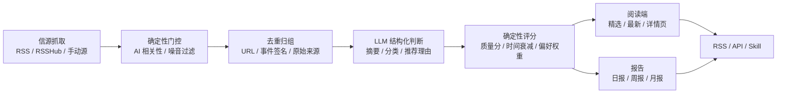

# AIWatch

> AI 圈一天发太多东西，等我反应过来已经过气了。AIWatch 把高信号 AI 动态、每日精编日报和可编程接口放在一起，让人和 Agent 都能更快知道今天真正值得看的事。

[在线体验](https://aiwatch.icu/) · [Agent 接入](https://aiwatch.icu/aiwatch-skill/) · [SKILL.md](https://aiwatch.icu/aiwatch-skill/SKILL.md) · [OpenAPI 3.1](https://aiwatch.icu/openapi.yaml)

AIWatch 是一个中文优先的 AI 信息雷达：从官方博客、研究团队、产品账号、技术分享者和行业信源抓取内容，经过去重归组、LLM 结构化判断、确定性评分和主理人偏好校准，输出精选动态、全部动态、日报/周报/月报、RSS、匿名 REST API 和 Agent Skill。

## 它能做什么

- **低噪 AI 信息流**：精选模式会压低官方 PR、客户案例、营销软文和低价值转发；全部动态仍按时间线保留，方便追溯。
- **中文站内阅读**：外文内容自动整理为中文标题、摘要、推荐理由和正文；详情页保留原文入口、富文本正文、图片、代码块和表格。
- **重复报道归组**：同一事件的官方原文、中文报道、X 转发和二次解读会合并到一个事件里，优先保留最早来源并展示多信源覆盖。
- **每日/每周/每月报告**：日报帮助快速读完一天，周报/月报沉淀趋势；历史归档可按日期回看。
- **偏好学习**：管理员的“有用 / 无用”标注会进入长期偏好，影响精选权重、信源复核和降噪规则。
- **读者工作台**：支持搜索、分类、信源筛选、主题板、点赞、收藏、评论、反馈和推荐信源。
- **RSS / API / Skill 三轨接入**：阅读器、脚本和 Agent 都能匿名读取公开内容，无需 API Key、无需 MCP server。
- **管理员看板**：查看信源输出、健康状态、LLM 成本、站点阅读行为、精选晋级和用户反馈。

## Agent 一句话接入

让支持 `SKILL.md` 的 Agent 用最自然的中文一句话拿到 AIWatch 每天的 AI 动态和日报。

在 Claude Code、Codex CLI、Cursor、Gemini CLI、GitHub Copilot、OpenCode、Cline、Windsurf 等 Agent 里直接发送：

```text
帮我安装这个 skill：https://aiwatch.icu/aiwatch-skill/
```

安装后可以这样问：

```text
今天 AI 圈有什么新东西
看一下今天的 AI 日报
最近 OpenAI 有什么发布
最近一周的 AI 论文
看下精选条目
AI 模型发布列表
最近 3 天 AI 行业动态
AI 圈昨天发生了什么
```

Skill 会按意图自动分流：

| 用户意图 | 端点 |
| --- | --- |
| 默认宽问题，例如“今天 AI 圈” | `GET /api/public/items?mode=selected&since=...` |
| 明确说“日报” | `GET /api/public/daily` 或 `GET /api/public/daily/{date}` |
| 明确说“全部 / 完整 / 全量” | `GET /api/public/items?mode=all&since=all` |
| 模型 / 产品 / 论文 / 技巧等分类问题 | `GET /api/public/items?mode=selected&category=...` |
| 公司、产品、关键词搜索 | `GET /api/public/items?q=OpenAI` |
| 查询有哪些日报日期 | `GET /api/public/dailies?take=N` |

> 搜索在服务端完成，不需要 Agent 先拉全量再本地 grep。

## RSS 订阅

所有主流 RSS reader 都可以直接订阅：

| Feed | 适合谁 | URL |
| --- | --- | --- |
| AIWatch 精选 | 大多数人，只想看每天最值得读的内容 | `https://aiwatch.icu/feed.xml` |
| 全部 AI 动态 | 想自己筛选、追更一手信息的人 | `https://aiwatch.icu/feed/all.xml` |
| AIWatch 日报 | 想在阅读器里每天读一篇精编日报的人 | `https://aiwatch.icu/feed/daily.xml` |

RSS 2.0，UTF-8。条目链接指向站内阅读页，正文尽量内联，原文链接保留在条目末尾。

## 公共 API

公开端点匿名只读，只暴露浏览器里也能看到的最终内容字段；完整 schema 见 [OpenAPI 3.1](https://aiwatch.icu/openapi.yaml)。

```bash
curl 'https://aiwatch.icu/api/public/items?mode=selected&since=today'
curl 'https://aiwatch.icu/api/public/items?q=OpenAI'
curl 'https://aiwatch.icu/api/public/daily'
curl 'https://aiwatch.icu/api/public/dailies?take=10'
```

常用参数：

- `mode`: `selected`（精选，默认）或 `all`（全部动态）
- `since`: `today`、`week`、`month`、`all`
- `category`: `product`、`technology`、`tips`、`discussion`
- `contentTypes`: `release`、`research`、`howto`、`opinion`、`news`
- `sourceTypes`: `official`、`employee`、`expert`、`kol`、`media`、`community`、`open_source_project`
- `q`: 服务端搜索标题、摘要、来源和标签
- `take`: 默认 20，最大 50，使用 `next_cursor` 翻页

## 工作流



核心原则：

- **LLM 只给结构化判断**，最终评分、晋级、归组、预算和展示规则尽量由确定性代码完成。
- **精选宁缺毋滥**，全部动态保留时间线；“有用 / 无用”标注长期影响权重，而不是一次性手调。
- **信源是数据，连接器是代码**。生产信源和事件库是运营资产，开源仓库只包含代码、schema、工具和示例数据。
- **失败闭合**。LLM、RSSHub、抓取器或预算异常时会记录失败状态，不用假数据静默兜底。

## Loop Engineering（持续进行中）

AIWatch 会按“发现问题 → 调研竞品 → 小步实现 → 验证上线 → 复盘沉淀”的循环持续迭代。以下方向不是一次性完成项，而是每轮更新都会回看的长期轨道：

- **信源故障处理台**：集中显示 X token、RSSHub、失败信源、失败原因、建议动作和一键重测。
- **偏好影响说明**：解释一次“有用 / 无用”标注如何改变分类、信源、关键词和精选权重。
- **事件多源视角**：同一热点下展示官方、中文媒体、英文原文、开发者和 X 讨论的共同点与差异。
- **信源导入向导**：导入后立即抓取最新一条，成功才启用，失败给出可行动原因。
- **运维清理任务**：把磁盘、旧镜像、日志、RSSHub token、LLM token 预算纳入后台看板。
- **知识库导出与 AI 管家**：详情页输出 Markdown / Obsidian frontmatter，站内 AI 助手回答当前内容和功能使用问题。

## 自托管快速开始

### Docker

```bash
cp .env.example .env
docker compose up --build
docker compose run --rm web bun run db:seed:demo
docker compose run --rm web bun run setup:owner you@example.com 'your-password'
```

打开 `http://localhost:3000`。后台为 `/_admin`，需要先登录 owner 账号。

### 本地开发

```bash
docker compose up -d db
cp .env.example .env
bun install
bun run db:migrate
bun run db:seed:demo
bun run setup:owner you@example.com 'your-password'
bun run dev
```

另开一个终端运行 worker：

```bash
bun run worker
```

## 技术栈

- **Web**：Next.js App Router、React、TypeScript
- **Runtime**：Bun
- **Database**：PostgreSQL、Drizzle ORM
- **Worker**：graphile-worker
- **Auth**：better-auth
- **Feeds**：RSS / Atom / RSSHub
- **LLM**：OpenAI-compatible provider，带成本预算和失败闭合

## 常用命令

```bash
bun run typecheck
bun run lint
bun test src
bun run build
bun run verify
bun run verify:full
bun run sources:audit
```

## 数据与安全边界

- 仓库不包含生产数据库、真实用户数据、真实 API Key、cookies、访问 token 或生产 `.env`。
- 公开 API 只读、限流、分页，不提供全量导出。
- 摘要和推荐理由由 LLM 生成，重要引用请以原文为准。
- X/Twitter 类信源依赖自托管 RSSHub 和有效 token；详见 `docs/deploy-ghcr.md`。

## 文档

- 架构概览：`docs/architecture.md`
- 信源策略：`docs/source_policy.md`
- 部署说明：`docs/deploy-ghcr.md`
- 迭代经验：`docs/iteration-memory.md`
- Agent 接入页：`src/app/aiwatch-skill/page.tsx`
- Skill 内容：`src/public/skill-md.ts`
